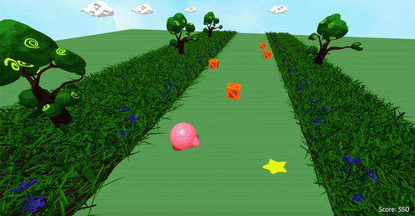

# Kirby-of-stars 🌟

- Kirby run away from obstacles
- Using Three.js & WebGL to implemnt 3D graphic

## Demonstration Video 📹

- [KIRBY-INTO-THE-GRAPHICS](https://www.youtube.com/watch?v=FDBdSUMs4p8) << Click Here !!

## Motivation 🧐

### Kirby 🎀

- Action game series that Nintendo distributed
- Main character is able to suck in enemies

### Chrome Dino 🦖

- Mini game that comes up when the network is disconnected from Chrome
- Can simply play it using a space bar or arrow keys

## Main Features 🏁

### Kirby run 🏃

- Running on an infinite map
- jump and avoid obstacles
- Its getting faster and faster

### Kirby eat item 🍭

- If you eat an item, the character rides the star
- Game never ends even if you hit by the obstacle

### Game over / Scoring 🎮

- Higher scores depending on the obstacles you avoided
- Shows the score at the corner of the screen

## TEAM 👩‍👩‍👦👩‍👧

<table align="center">
    <tr>
        <td align="center"><a href="https://github.com/dyeon999"><b>202035309 김도연</b></a></td>
        <td align="center"><a href="https://github.com/EunsuSeo01"><b>202035340 서은수</b></a></td>
        <td align="center"><a href="https://github.com/edv-Shin"><b>202035344 신동원</b></a></td>
        <td align="center"><a href="https://github.com/jrary"><b>202035360 이다현</b></a></td>
        <td align="center"><a href="https://github.com/joeun-01"><b>202035386 정조은</b></a></td>
    </tr>
    <tr>
        <td align="center" width="200">
          Obstacle(box, thorns) Modeling 
          Obstacle Logic 
          Add Sound Effects 
        </td>
        <td align="center" width="200">
          Obstacle(dragonfly) Modeling 
          Obstacle Logic 
          Scoring & Ending Logic 
        </td>
        <td align="center" width="200">
          Kirby Modeling 
          Main Character logic 
          Item Effect Logic 
        </td>
        <td align="center" width="200">
          Base settings 
          Background Modeling 
          Background Logic 
        </td>
        <td align="center" width="200">
          Star Item Modeling 
          Main Character logic 
          Obstacle Logic 
        </td>
    </tr>
</table>
