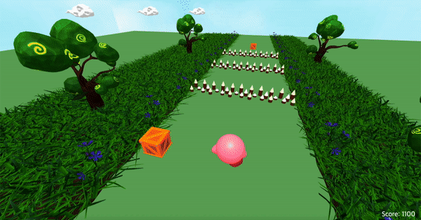

# Kirby-of-stars

- Kirby run away from obstacles
- Using Three.js & WebGL to implemnt 3D graphic

## Motivation

### Kirby

- Action game series that Nintendo distributed
- Main character is able to suck in enemies

### Chrome Dino

- Mini game that comes up when the network is disconnected from Chrome
- Can simply play it using a space bar or arrow keys

## Main Features

### Kirby run

- Running on an infinite map
- jump and avoid obstacles
- Its getting faster and faster

### Kirby eat item

- If you eat an item, the character rides the star
- Game never ends even if you hit by the obstacle

### Game over / Scoring

- Higher scores depending on the obstacles you avoided
- Shows the score at the corner of the screen

## TEAM

<table align="center">
    <tr>
        <td align="center"><a href="https://github.com/dyeon999"><b>202035309 김도연</b></a></td>
        <td align="center"><a href="https://github.com/EunsuSeo01"><b>202035340 서은수</b></a></td>
        <td align="center"><a href="https://github.com/edv-Shin"><b>202035344 신동원</b></a></td>
        <td align="center"><a href="https://github.com/jrary"><b>202035360 이다현</b></a></td>
        <td align="center"><a href="https://github.com/joeun-01"><b>202035386 정조은</b></a></td>
    </tr>
        <tr>
        <td align="center">
          Obstacle(box and thorns) Modeling
          Obstacle Logic
          Add Sound Effects
        </td>
        <td align="center">
          Obstacle(dragonfly) Modeling
          Obstacle Logic
          Scoring & Ending Logic
        </td>
        <td align="center">
          Kirby Modeling
          Main Character logic
          Item Effect Logic
        </td>
        <td align="center">
          Base settings
          Background Modeling
          Background Logic
        </td>
        <td align="center">
          Star Item Modeling
          Main Character logic
          Obstacle Logic
        </td>
    </tr>
</table>
